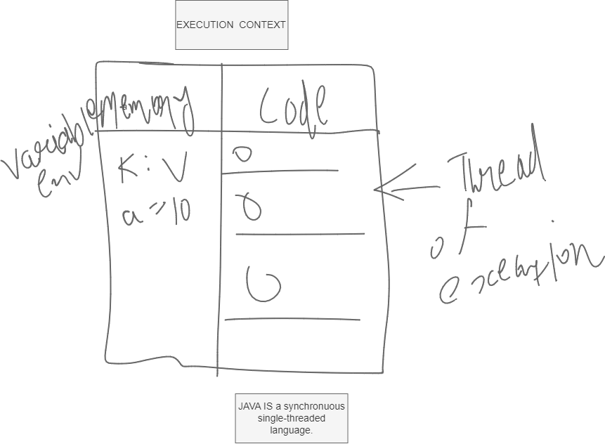
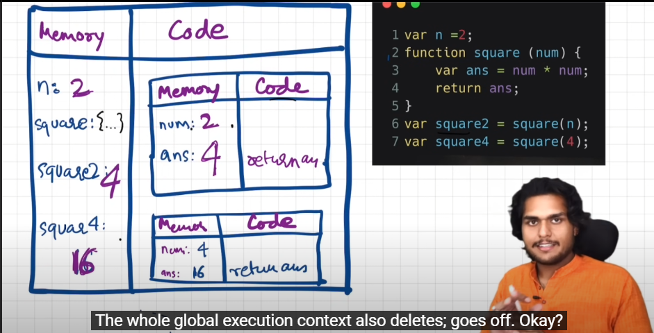
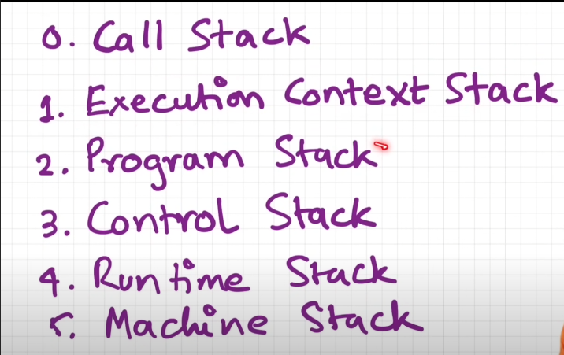

<h1><center>BASIC OF JAVASCRIPT</center></h1>

INTRODUCTION :

Every thing in javascriipt happens inside an execution context.

javascript is a <font color ="red">synchronuous</font> single-threaded language.

TWO FASE IN JAVASCRIPT : <font color ="red">(1)</font> MEMORY CREATION AND <font color ="red">(2)</font> CODE EXECTION FASE 






how javascript is manage all this creation and deletion part? - > ans is STACK
```
    |     |
    -------
    |     |
    -------
    | EX1 |
    -------
    | GES |
    -------

```
CALL STACK > "call stack maintains the order of exection of exection contexts."

javascript also known as :


```
TOPIC :
1)HOSTING IN JAVASCROIPT
2)Diffrence between define snd undefine in javascript.
3)Arrow function in javaScript
  -> var data  = () = > {consol.log("function")}
```

```javascript
// Function Invocation and variable Enviorment :
var x = 1;
a();
b();
console.log(x);

function a(){
    var x = 10;
    console.log(x);
}

function b(){
    var x = 100;
    console.log(x);
}

Output : 10
         100
         1
```
